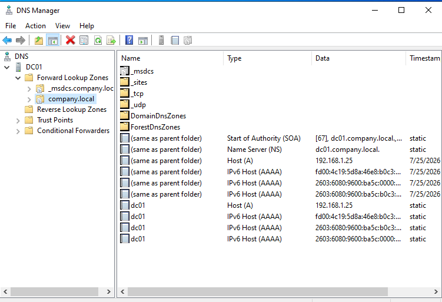

# 🖥️ Enterprise IT Infrastructure Lab

## Overview

This project documents the design, implementation, and administration of a simulated enterprise IT environment built to develop hands-on experience in Windows Server administration, Active Directory, Microsoft 365, Microsoft Entra ID, networking, and IT support.

The lab mirrors many of the core technologies used in small and medium-sized business environments and demonstrates practical skills expected of an entry-level IT Support or Systems Administrator.

---

# 🎯 Project Objectives

* Deploy Windows Server 2022
* Configure Active Directory Domain Services
* Create and manage Organizational Units (OUs)
* Configure DNS
* Join client computers to the domain
* Create shared folders and configure NTFS permissions
* Configure Microsoft 365 and Microsoft Entra ID
* Deploy a GLPI Help Desk environment
* Document all configuration and troubleshooting steps

---

# 🏗️ Lab Architecture

> **Network Diagram**


---

# 🛠️ Technologies Used

* Windows Server 2022
* Windows 10
* Active Directory Domain Services (AD DS)
* DNS
* NTFS Permissions
* SMB File Sharing
* Microsoft 365 Business
* Microsoft Entra ID
* GLPI Help Desk
* GitHub
* PowerShell
* Virtualization

---

# ✅ Completed Projects

* Active Directory Deployment
* Domain Controller Configuration
* DNS Configuration and Troubleshooting
* Organizational Unit (OU) Design
* User and Group Management
* Shared Folder Configuration
* NTFS Permissions
* Microsoft 365 Tenant Administration
* Microsoft Entra ID Administration
* Security Defaults Configuration
* GLPI Help Desk Deployment
* GitHub Portfolio Documentation

---

# 📂 Repository Structure

```text
Enterprise-IT-Home-Lab
│
├── README.md
├── Documentation
├── Screenshots
├── Network-Diagrams
├── PowerShell
├── Ticket-Scenarios
└── Assets
```

---

# 📖 Documentation

* Active Directory Implementation
* DNS Troubleshooting
* File Server Permissions
* Microsoft 365 Administration
* Microsoft Entra ID User Management
* Home Lab Architecture
* Group Policy Basics

---

# 📸 Screenshots

This repository includes screenshots demonstrating:

## Active Directory Users and Computers


Created Organizational Units, domain users, and managed Active Directory objects.

---

## DNS Manager



Configured the **company.local** DNS zone and verified Active Directory-integrated DNS records.

---

## Shared Folder Configuration


Configured SMB sharing for the Sales department.

---

## NTFS Permissions


Configured folder security using NTFS permissions.

---

## Microsoft 365 Administration


Managed users, licensing, and Microsoft 365 administration.

---

## Microsoft Entra ID


Configured users, security settings, and identity management.

---

## GLPI Help Desk


Implemented a help desk environment for ticket management and IT support.

---

# 💡 Skills Demonstrated

## Windows Server Administration

* Server installation
* Role management
* Active Directory
* DNS
* File Services

## Microsoft Cloud Administration

* Microsoft 365
* Microsoft Entra ID
* Identity Management
* Licensing
* Security Defaults

## Help Desk

* User Administration
* Password Resets
* Access Troubleshooting
* Documentation
* Incident Management

## Git & Documentation

* GitHub
* Markdown
* Technical Documentation
* Version Control

---

# 🚀 Future Improvements

* Group Policy deployment
* DHCP configuration
* WSUS
* PowerShell automation
* Azure integration
* Microsoft Intune
* Microsoft Defender for Endpoint

---

# 👨‍💻 Author

**George Baker**

GitHub: https://github.com/GeorgeB808

---

⭐ *Thank you for visiting my Enterprise IT Home Lab portfolio.*
